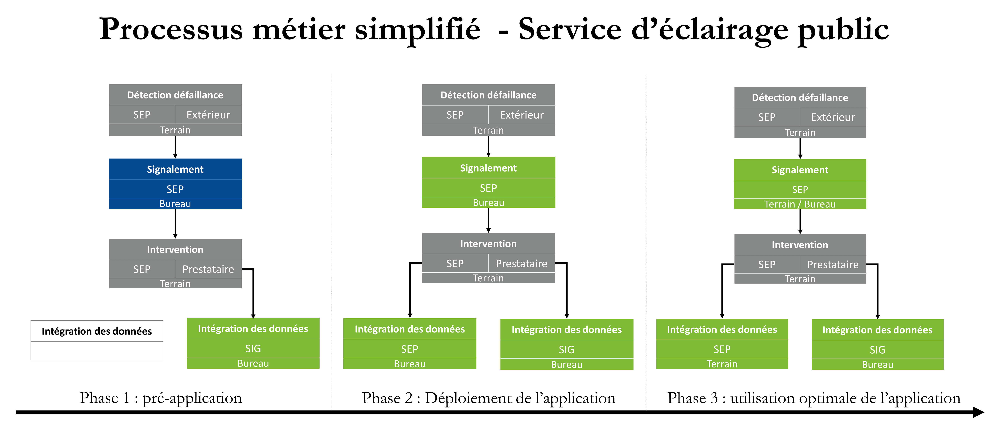

# Documentation synthétique du métier et du réseau d'éclairage public.

* Statut
  - [ ] à rédiger
  - [x] en cours de rédaction
  - [ ] relecture
  - [ ] finaliser
  - [ ] révision
  
* Historique des versions

|Date | Auteur | Description
|:---|:---|:---|
|30/07/2019|Thibaud BILLOTEAU|version initiale|

## Généralités

Les informations réunies ici ont pour but la compréhension globale du fonctionnement du métier et du réseau d'éclairage public dans la ville de Compiègne et dans les zones de gestion de l'ARC. 

## Fonctionnement du réseau

### Vocabulaire :

Le vocabulaire de l'éclairage public diverge d'une structure à l'autre, des choix de simplification ont été faits, ils sont présentés ici.

#### Ouvrages électriques : 
   - Armoires principales : Reliées au réseau ENEDIS et disposant d'un système de commande d'allumage/exctinction.
   - Sous-armoires/coffret : Reliés à une armoire principale.
   - Transformateur : Reliés à une armoire principale, change la tension du courant. 
    
  Les ouvrages sont composés de plusieurs éléments, dont un ou plusieurs départ(s).
  
#### Départs :
  Situés dans un ouvrage électrique, les câbles branchés aux départs amènent le courant électrique jusqu'aux autres éléments du réseau. 
    
#### Points lumineux : 
  Les points lumineux sont composés d'un support et d'un ou plusieurs foyer(s).
  
#### Foyers :
  Liés à un support, les foyers sont composés d'une lanterne et d'une lampe.
  La platine (disjoncteur / fusible / ballast / driver...etc.) est liée à un foyer, même si elle peut être située dans un support.

#### Points d'intérêts :
  Les points d'intérêt représentent un point d'importance pour la connaissance patrimoniale du réseau, mais ne possédant pas de caractéristiques intrasèques intéressantes pour l'éclairage public. 
  Exemple : sous-marin (boite de raccordement de câble souterrain), panneaux publicitaires, bornes... etc. 
  
#### Câbles :
  Les câbles sont généralement composés de 4 fils : 3 phases et 1 neutre. Ils peuvent aussi être composés d'un neutre et d'une phase, voire parfois d'uniquement 3 phases, une des phases étant généralement utilisée comme neutre en ce cas.
  Les câbles sont différenciés entre souterrain et aérien, puis souterrain blindé ou non et aérien nu ou torsadé. Les câbles "muraux" sont aussi une catégorie à part.
  
### Fonctionnement électrique

### Cheminement :
  1 - Le courant électrique part du réseau d'un fournisseur d'énergie (ENEDIS par exemple). 
  2 - Il arrive jusqu'à une armoire principale.
  3 - Il repart de l'armoire via les câbles branchés aux départs, uniquement si l'armoire est "allumée".
      La gestion de l'allumage se fait via un système de commande (Radio BH, forfait SOGEME, horloge astronomique...) et est indépendant par départ.
      Le réseau est généralement allumé la nuit, cependant certaines armoires (déservant les caméras, feux tricolores, feux piétons...) restent allumées en continu. 
  4 - Les câbles amènent le courant jusqu'aux différents éléments du réseau.
 
Des protections électriques peuvent être présentes au niveau des ouvrages, point lumineux / d'intérêts... etc : Fusibles et/ou disjoncteurs.

### Fonctionnement de la tension

  La tension peut-être de 3200 volts maximum, cette tension correspond à un réseau particulier de la ville de compiègne, partant du Poste PAN (considéré comme une armoire principale ici). Les lampes d'éclairage fonctionnant en 230 ou 400 V, des transformateurs sont alors nécessaires pour changer la tension délivrée.
  Parfois, les lanternes possèdent des autotransformateurs modifiant la tension dans la lampe elle-même. 

  Chaque câble est composé de plusieurs fils. Sur un câble de tension 230-400V, entre le fil neutre et un fil de phase une tension de 230 V est délivrée. Entre deux fils de phase, une tension de 400 V est délivrée. Ainsi, un même câble peut délivrer des tensions différentes selon la façon dont il est branché à un élément du réseau.
  On notera donc la tension 230-400 V. 
  
  
## Fonctionnement du service d'éclairage public de la ville de Compiègne

Voici un schéma résumant la transition d'organisation de service d'éclairage public avec l'utilisation de l'application.

 
